<h1>👋 Hey there, I'm Fran Alapont Sánchez</h1>

<h3>🎓 Master's student at EDEM | AI & LLM Inference</h3>

---

## 👋 About me

Hi! I'm **Fran Alapont Sánchez**, a Mathematics graduate currently pursuing a **Master's degree at EDEM**, with a strong interest in **Artificial Intelligence and Large Language Models**.

I'm currently part of the **Inference team at Nextbit256**, where I work closely with open-source LLMs, inference infrastructure and model deployment.

My main goal right now is simple: **learn as much as possible about AI by building, experimenting and working with real-world systems**.

This GitHub is where I'll share some of the projects, experiments and work I develop throughout the year.

## 🚀 What I'm interested in

- 🤖 Artificial Intelligence & Large Language Models
- ⚡ LLM inference and optimization
- 🧠 Open-source AI models
- 🐍 Python & Machine Learning
- 📊 Mathematics applied to AI
- 🛠️ Building and experimenting with AI systems

## 🔎 Explore

Feel free to explore my repositories and follow along with what I'm building and learning.

👉 [github.com/franalapontedem](https://github.com/franalapontedem)

